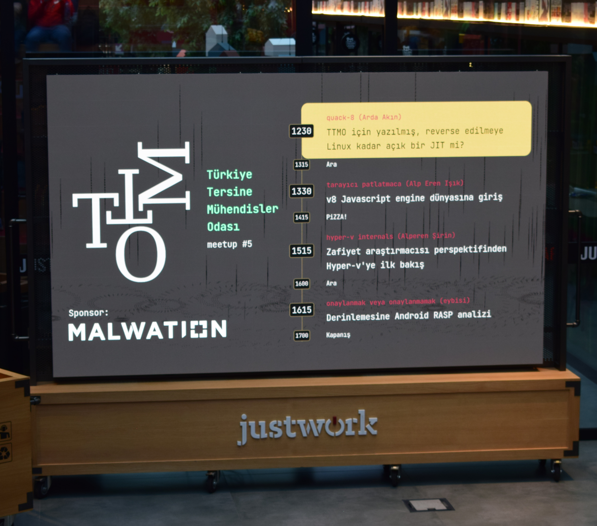

# meetup5-interface

Yazılım dillerinin, frameworklerinin ve yardımcı araçların başını alıp gittiği
günümüzde son dakika projeleri de çok hızlı geliştirilebiliyor. İşte bunun son
örneği: meetup #5 için geliştirdiğimiz arayüz.



- Arka plan: Dwitter'dan tüm zamanların en iyi animasyonları.
- Font: JetBrains Mono
- Renk paleti: Paha biçilemez.

Pull Request'lere kapımız her zaman açık. (Bkz. [Hacktoberfest](https://hacktoberfest.com))

## Denemek Bedava

```sh
npm install
npm run dev
```